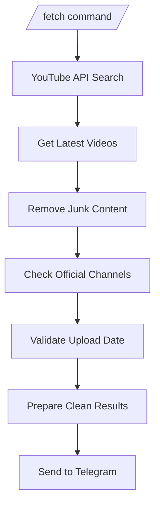

<h1 align="center">🎬 TrailerBot</h1>

<p align="center">
🚀 Automatically fetch latest official movie trailers and send them to Telegram
</p>

<p align="center">
  
  
  
  
</p>

---

## 🎯 Overview

TrailerBot is a Telegram bot that:
- 🔍 Searches YouTube for latest trailers  
- 🎯 Filters only official content  
- 📤 Sends results directly to Telegram  

---

## 📸 Preview

<p align="center">
  
  
</p>

---

## ⚙️ How It Works



---

## ✨ Features

- 🎬 Fetch latest trailers instantly  
- 🚫 Blocks reaction & fake videos  
- 📅 Shows only recent uploads  
- 🎯 Prioritizes official channels  
- 📤 Sends directly to Telegram  
- ⚡ Fast & reliable  

---

## 🧠 Smart Filtering

### ❌ Removed:
- Reaction videos  
- Reviews & breakdowns  
- Fan edits  

### ✅ Allowed:
- Official trailers  
- Verified channels  
- Recent uploads  

---

## 🚀 Installation

### 1️⃣ Clone Repository

```bash
git clone https://github.com/digin-portfolio/trailer.git
cd trailerbot
```

---

### 2️⃣ Install Requirements

```bash
pip install -r requirements.txt
```

---

### 3️⃣ Setup Environment Variables

Create a `.env` file:

```env
BOT_TOKEN=your_bot_token
YOUTUBE_API_KEY=your_api_key
TARGET_CHANNEL=your_channel_id
ADMIN_ID=your_user_id
```

---

### 4️⃣ Run the Bot

```bash
python trailerbot.py
```

---

## 🤖 Commands

| Command | Description |
|--------|------------|
| /start | Start bot |
| /fetch | Fetch latest trailers |

---

## 📂 Project Structure

```
trailerbot/
│
├── trailerbot.py
├── README.md
├── requirements.txt
├── .gitignore
└── .env (not uploaded)
```

---

## 🔐 Security

- Uses `.env` for secrets  
- No API keys exposed  
- Safe for public repositories  

---

## 🚀 Future Plans

- 🤖 Auto-post trailers  
- 🎯 Category filters  
- 📊 Trending detection  
- 🌐 Web dashboard  

---

## 🙌 Credits

Made with ❤️ by Digin  

---

<p align="center">
⭐ Star this repo if you like it!
</p>
